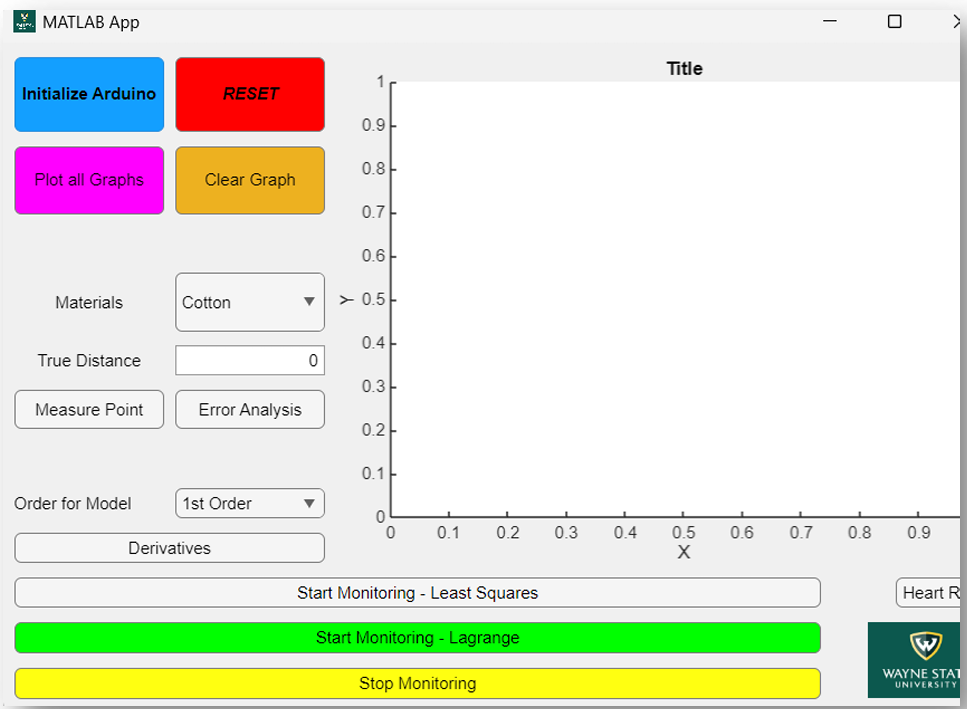
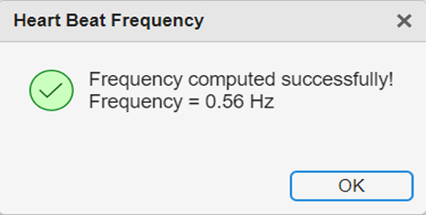
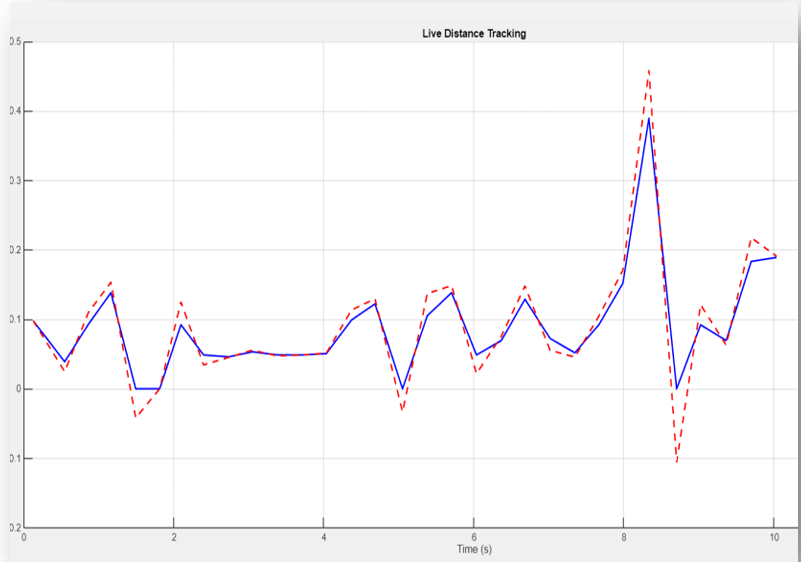
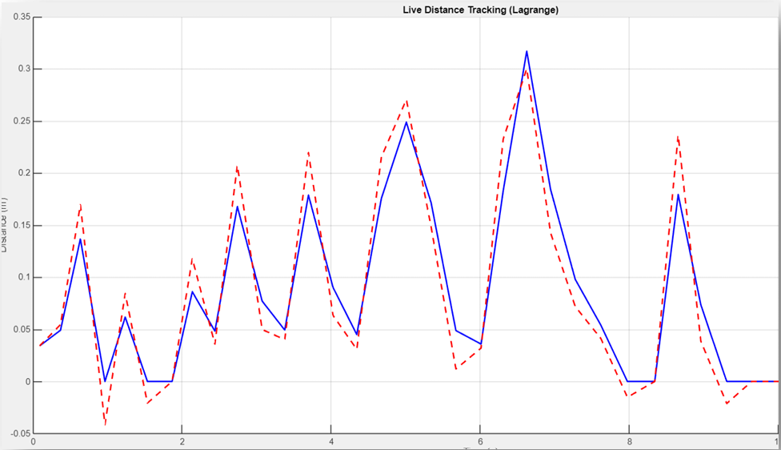
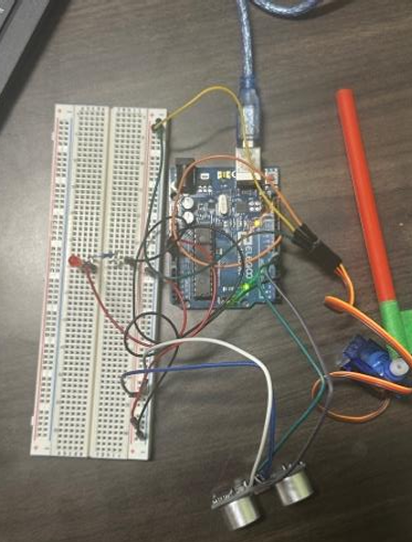

# Heart Rate Prediction GUI

### Real-Time Ultrasonic Motion Tracking Using MATLAB App Designer and Arduino

This project is a real-time motion tracking and prediction system built with **MATLAB App Designer**, **Arduino Uno**, an **HC-SR04 ultrasonic sensor**, and a **servo motor**. The system simulates heartbeat-like motion by measuring the distance of a moving surface, estimating its frequency, predicting its future position, and controlling a servo motor to follow the motion.

The project was developed for **Numerical Methods (ECE3040) Project #1** at Wayne State University.


---

## Demo Video

Watch the project demonstration here:

[View Demo on YouTube](https://www.youtube.com/watch?v=RMuPWADoMFA)

---

## Table of Contents

* [Project Overview](#project-overview)
* [Features](#features)
* [System Design](#system-design)
* [Hardware Components](#hardware-components)
* [Wiring](#wiring)
* [Numerical Methods Used](#numerical-methods-used)
* [How the System Works](#how-the-system-works)
* [MATLAB GUI](#matlab-gui)
* [Sample Results](#sample-results)
* [Project Files](#project-files)
* [Method Comparison](#method-comparison)
* [Results Summary](#results-summary)
* [Limitations](#limitations)
* [Future Improvements](#future-improvements)
* [Repository Structure](#repository-structure)
* [How to Run](#how-to-run)
* [Team Members](#team-members)
* [Course Information](#course-information)

---

## Project Overview

Real-time tracking systems often experience delay between measurement, computation, and mechanical response. In this project, an ultrasonic sensor measures the distance of a moving object that represents a simulated heartbeat or oscillating surface. The MATLAB GUI records distance-time data and applies numerical methods to estimate motion frequency and predict the object’s future position.

The predicted position is then converted into a servo angle so the servo motor can attempt to follow the moving object in real time.

The main goal of this project was to combine:

* real-time sensor data acquisition
* MATLAB App Designer GUI development
* Arduino hardware control
* numerical methods for prediction
* servo-based mechanical response

---

## Features

* Real-time distance measurement using the HC-SR04 ultrasonic sensor
* MATLAB App Designer graphical user interface
* Arduino Uno hardware integration
* Servo motor control using predicted distance values
* LED indicator for system feedback
* Distance vs. time plotting
* Frequency estimation using zero-crossing behavior
* Least-squares polynomial regression prediction
* Lagrange polynomial interpolation prediction
* User-selected material and true-distance input
* Error analysis between true and measured distance
* Live monitoring start/stop controls

---

## System Design

The system follows this general pipeline:

```text
Moving Surface / Simulated Heartbeat
        ↓
HC-SR04 Ultrasonic Sensor
        ↓
Arduino Uno
        ↓
MATLAB App Designer GUI
        ↓
Numerical Methods
        ↓
Predicted Future Distance
        ↓
Servo Motor Angle
```

The ultrasonic sensor collects distance data from the moving surface. MATLAB stores the measured distance and time values, processes the data using numerical methods, and predicts the position approximately 100 milliseconds into the future. The prediction is then mapped to a servo motor angle.

---

## Hardware Components

| Component                 | Purpose                                                      |
| ------------------------- | ------------------------------------------------------------ |
| Arduino Uno               | Main microcontroller used for sensor and servo communication |
| HC-SR04 Ultrasonic Sensor | Measures distance from the moving surface                    |
| Servo Motor               | Follows the predicted position of the moving object          |
| LED                       | Provides system feedback/status indication                   |
| Breadboard                | Used for circuit assembly                                    |
| Jumper Wires              | Used for connections                                         |
| Resistor                  | Used with the LED                                            |
| USB Cable                 | Connects Arduino to MATLAB computer                          |

---

## Wiring

| Device       | Arduino Pin | Description            |
| ------------ | ----------- | ---------------------- |
| HC-SR04 VCC  | 5V          | Sensor power           |
| HC-SR04 GND  | GND         | Common ground          |
| HC-SR04 TRIG | D7          | Ultrasonic trigger pin |
| HC-SR04 ECHO | D6          | Ultrasonic echo pin    |
| LED          | D3          | Status indicator       |
| Servo Signal | D11         | PWM servo control pin  |

The servo motor uses Arduino pin **D11**, which supports pulse-width modulation control.

---

## Numerical Methods Used

This project uses multiple numerical methods to analyze and predict the motion of the simulated heartbeat surface.

### 1. Newton Divided Differences / Zero-Crossing Frequency Estimation

The system estimates the oscillation frequency by detecting zero crossings in the centered distance signal. The distance signal is centered by subtracting the mean value from the measured distance data.

The frequency is calculated using:

```text
f = 1 / T
```

where:

* `f` is the frequency
* `T` is the period of oscillation

The user selects two points that are approximately one period apart, and the GUI finds the forward zero crossing to estimate the frequency.

---

### 2. Least-Squares Regression

Least-squares regression is used to predict the future position of the moving object using recent distance-time data.

For a first-order model:

```text
d(t) = a0 + a1t
```

For a second-order model:

```text
d(t) = a0 + a1t + a2t^2
```

For a third-order model:

```text
d(t) = a0 + a1t + a2t^2 + a3t^3
```

The model is evaluated at:

```text
t_future = t_current + 0.1
```

This predicts the distance approximately **100 milliseconds ahead** to compensate for system delay.

Least-squares regression is useful because it smooths noisy sensor data and gives stable predictions.

---

### 3. Lagrange Polynomial Interpolation

Lagrange interpolation is also used to predict the future distance of the moving surface.

The general Lagrange interpolation formula is:

```text
P(t) = Σ y_i L_i(t)
```

where:

```text
L_i(t) = Π (t - t_j) / (t_i - t_j),   j ≠ i
```

Lagrange interpolation creates a polynomial that passes through selected recent data points. This allows the model to follow short-term motion closely, but it can be sensitive to noise.

---

## How the System Works

1. The user opens the MATLAB App Designer GUI.
2. The user initializes the Arduino connection.
3. The ultrasonic sensor begins measuring the distance of the moving surface.
4. MATLAB records time and distance data.
5. The GUI plots the measured distance in real time.
6. The user can select points to estimate the motion frequency.
7. The system applies least-squares regression or Lagrange interpolation.
8. The predicted distance is calculated 100 milliseconds ahead.
9. The predicted distance is converted into a servo motor angle.
10. The servo attempts to follow the moving surface based on the predicted position.

---

## MATLAB GUI

The MATLAB GUI allows the user to initialize the Arduino, reset the system, start and stop monitoring, plot data, clear graphs, select materials, enter true-distance values, perform error analysis, select numerical methods, and compute the oscillation frequency.



---

## Sample Results

The system successfully measured and plotted live distance data from the ultrasonic sensor. The GUI was also able to estimate the oscillation frequency and predict future displacement using least-squares regression and Lagrange interpolation.

### Frequency Estimation

The GUI computed a sample oscillation frequency of **0.56 Hz** using selected waveform points and zero-crossing calculation.



---

### Least-Squares Prediction

Least-squares prediction produced smoother results and worked better when the ultrasonic sensor data contained noise.



---

### Lagrange Prediction

Lagrange interpolation followed short-term motion more closely, but it was more sensitive to noisy measurements.



---

### Hardware Setup

The hardware setup includes the Arduino Uno, HC-SR04 ultrasonic sensor, servo motor, LED indicator, breadboard, and jumper wires.



---

## Project Files

The main project files are linked below for easier access:

| File                                                                     | Description                                                   |
| ------------------------------------------------------------------------ | ------------------------------------------------------------- |
| [HeartRatePredictionGUI.mlapp](app/HeartRatePredictionGUI.mlapp)         | MATLAB App Designer GUI file                                  |
| [DistanceSensor.m.m](src/DistanceSensor.m.m)                             | MATLAB class/script for sensor setup and distance measurement |
| [heart_rate_prediction_gui_code.m](src/heart_rate_prediction_gui_code.m) | Exported MATLAB GUI code                                      |
| [Final Project Report](report/ECE3040_PROJECT_FINALREPORT.pdf)           | Final project report                                          |
| [Demo Video](https://www.youtube.com/watch?v=RMuPWADoMFA)                | YouTube demonstration video                                   |

---

## Method Comparison

| Method                   | Strength                                       | Weakness                            | Best Use                          |
| ------------------------ | ---------------------------------------------- | ----------------------------------- | --------------------------------- |
| Zero-Crossing Frequency  | Simple and effective for periodic motion       | Requires clear oscillation pattern  | Frequency estimation              |
| Least-Squares Regression | Smooths noisy data and gives stable prediction | May not follow sudden sharp motion  | Real-time noisy sensor prediction |
| Lagrange Interpolation   | Follows selected data points closely           | Sensitive to noise and oscillations | Short-term motion prediction      |

---

## Results Summary

From testing, both least-squares regression and Lagrange interpolation were able to predict the future position of the moving surface. The least-squares method performed better when the data contained noise because it smoothed the measurements. Lagrange interpolation was more responsive to small changes in the motion but could produce larger errors when the sensor readings were noisy.

The prediction window of **100 milliseconds** worked better than longer prediction intervals. Predicting too far into the future caused more error because the motion could change before the servo motor responded.

---

## Limitations

* The HC-SR04 sensor can produce noisy readings.
* Fast motion reduces prediction accuracy.
* Servo motor response delay affects real-time tracking.
* Higher-order polynomial models can overfit the data.
* Lagrange interpolation can become unstable with noisy measurements.
* The prediction accuracy decreases when predicting too far into the future.
* The system is designed for simulated heartbeat-like motion, not medical heart-rate measurement.

---

## Future Improvements

* Add filtering to reduce ultrasonic sensor noise.
* Add automatic zero-crossing detection without manual point selection.
* Compare different prediction windows, such as 50 ms, 100 ms, and 200 ms.
* Improve servo calibration for smoother motion tracking.
* Add more detailed error metrics for each numerical method.
* Save experimental data automatically to CSV files.
* Improve GUI layout and labeling.

---

## Repository Structure

```text
Heart-Rate-Prediction-GUI/
│
├── app/
│   └── HeartRatePredictionGUI.mlapp
│
├── src/
│   ├── DistanceSensor.m.m
│   └── heart_rate_prediction_gui_code.m
│
├── docs/
│   └── img/
│       ├── frequency_result.png
│       ├── gui_overview.png
│       ├── hardware_setup.png
│       ├── lagrange_result.png
│       └── least_squares_result.png
│
├── report/
│   └── ECE3040_PROJECT_FINALREPORT.pdf
│
└── README.md
```

---

## How to Run

### Requirements

* MATLAB R2023b or newer
* MATLAB Support Package for Arduino Hardware
* MATLAB Support Package Ultrasonic Library
* Arduino Uno
* HC-SR04 ultrasonic sensor
* Servo motor

### Steps

1. Clone or download this repository.
2. Connect the Arduino Uno to the computer using a USB cable.
3. Wire the HC-SR04 sensor, LED, and servo motor according to the wiring table.
4. Open MATLAB.
5. Install the required Arduino support packages if they are not already installed.
6. Open the MATLAB App Designer file located in the `app/` folder.
7. Run the GUI.
8. Click **Initialize Arduino**.
9. Start monitoring the distance data.
10. Select the desired numerical method and view the prediction results.

---

## Team Members

* Mina George
* Abid Ahmad
* Mustakim Choudhury

All team members contributed equally to the completion of this project.

---

## Course Information

**Course:** Numerical Methods
**Course Code:** ECE3040
**Project:** Project #1
**Institution:** Wayne State University
**Department:** Electrical and Computer Engineering
**Instructor:** Abhilash Pandya
